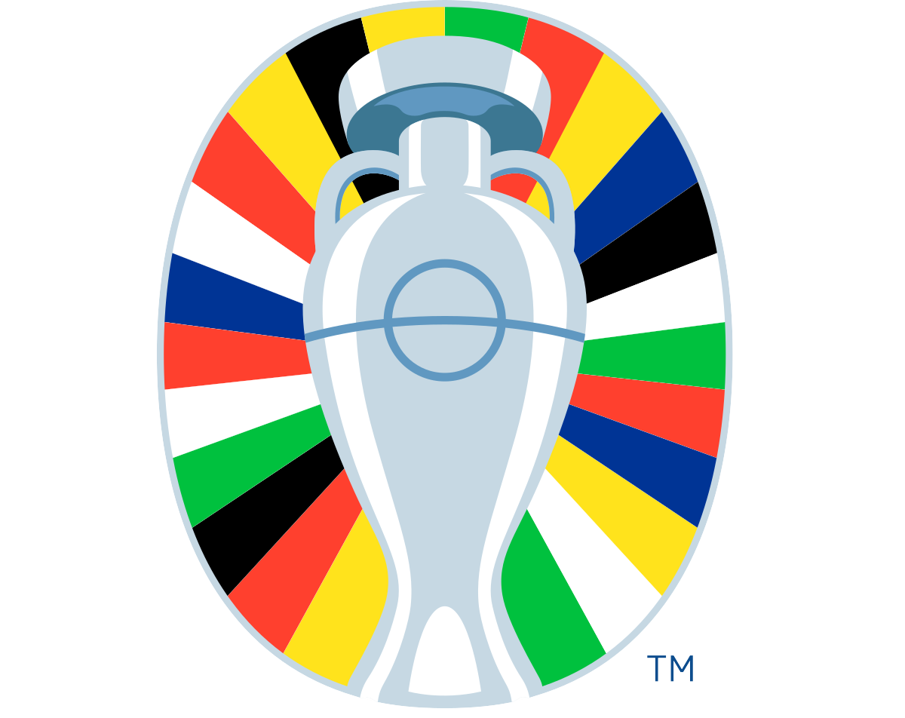
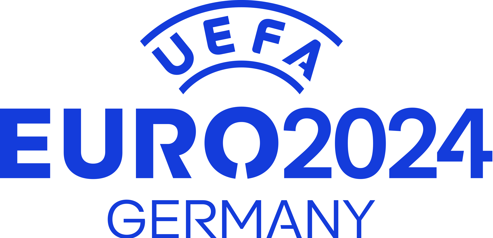

    
    

# EURO24: Custom goal anthem (Major Tom)
This simple website plays Major Tom by Peter Schiling as goal song whenever Germany scores during the EURO24 in Germany.

<a href="https://www.buymeacoffee.com/codemodeyt">Suppport this project!</a>

## Usage
Just open the website on <!--https://www.codemodeyt.github.io/EURO-CustomGoalAnthem--> https://euro-cga.netlify.app/

### During the game:
During the game, you can simply keep the page open in the background (on PC) or in the foreground (on mobile) and you just have to wait for a goal to happen.
There will be a live score that automatically updates every 3 seconds and the live minute count that will update every minute.
As soon as there is a goal for Germany, the hymne will automatically start to play.

*Make sure to have automatic playback of media enabled in your Browser! OTHERWISE, THE ANTHEM CAN'T BE PLAYED!*

**If you experience any issues, reload the page. If this doesn't fix it, please open an Issue!**

### If the game is not running yet:
There will be a countdown to the time the game starts. As soon as the game has started, you will get automatically redirected to the game page:

## The way it works
In the backend, a Python script checks for a change in score every 3 seconds and updates the playtime every minute.

As soon as theres an update in playtime / score, it gets sent to the frontend by using a websocket.

## Backstory
In the lead-up to UEFA EURO 2024 in Germany, a big wave of fan enthusiasm swept across the country, sparked by an Adidas commercial. The fans passionately wanted Peter Schilling's "Major Tom" to be the official goal anthem during the tournament. The German Football Association (DFB) even gave it a trial run in a subsequent friendly match. However, UEFA dashed those hopes by announcing that all teams would have the same goal anthem during EURO 2024, sticking to this decision despite several successful petitions.

Excited about the upcoming tournament, I decided to take matters into my own hands and find a way to give us German fans their desired goal anthem, "Major Tom".

#### UPDATE:
On the 1st of June, the DFB announced Major Tom as their new official goal anthem.
This does NOT affect the EUROs though, as the UEFA still holds on to their plan with every team having the same pre-set goal anthem.
